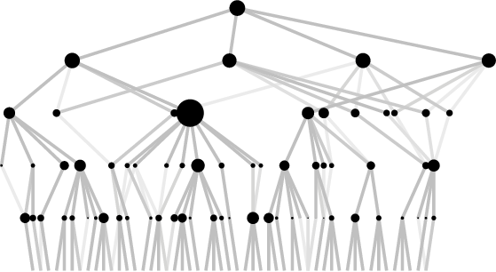

# A Random Network Model for Synaptic Plasticity
[This notebook](./simulation.ipynb) provides Python code for simulating a [A spatial Small-World model for synaptic plasticity arising from activity-based reinforcement](https://link.springer.com/chapter/10.1007/978-3-030-25070-6_8).

</a>

We consider a conceptually simplified random network model for the phenomenon of [synaptic plasticity](https://en.wikipedia.org/wiki/Synaptic_plasticity). We model the synaptic weight by a stochastic process on a fixed graph   thought of as a collection of neurons interconnected by synapses.

More precisely, consider the set of neurons  , which we think of copies of   organized in layers. The set of synapses  is obtained by connecting each neuron   in layer   to all neurons of the form   with  for a model parameter  1" /> . Loosely speaking,   governs the speed at which the visibility scope of a neuron increase, when moving to higher layers.

Additionally, the neurons feature iid heavy-tailed fitnesses  with a tail index  . 

On this marked network, we now define dynamically evolving synaptic weights   as follows. Each of the neurons is equipped with a Poisson clock. When the clock rings at neuron  at time  , then the corresponding neuron fires and the weight of one of the incident synapses (v, w) leading to the next layer increases by 1. The crux of the model lies in the selection mechanism. The selection of the synapse occurs at random with probability proportional to 
 

Hence, the model incorporates two effects. First, the fitter the neuron, the higher the probability that it is selected. Second, if a synapse was used frequently in the past, then it means that it is of importance and should be selected again with a higher probability in the future.

